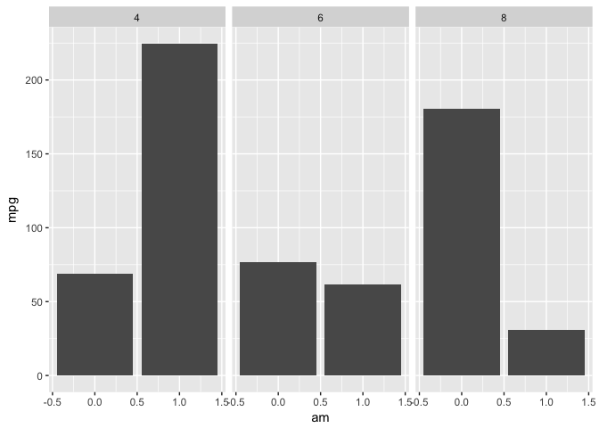
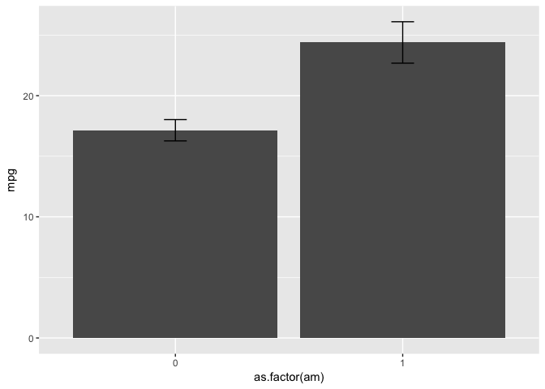
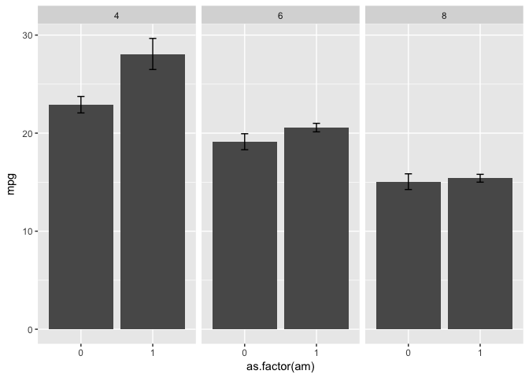

Rapid barplotting with stat\_summary() in ggplot2
================
JP
July 5, 2017

``` r
library(tidyverse)
```

During exploratory data analysis it can be tedious to generate tables of means and SEs for barplots, particularly when exploring subgroup effects. `stat_summary()` provides an efficient means of creating bar plots without having to first generate tables of means and SEs.

Without pre-calculating a table of means, `geom_col()` and the equivalent `geom_bar(stat = "identity")` erroneously produce summation counts for y-values, not means. Notice 200+ mpg on the second column.

``` r
mtcars %>% 
  ggplot(aes(x = am, y = mpg)) + 
  geom_col() + 
  facet_grid(~ cyl)
```



`stat_summary()` accurately produces bar plots without having to compute tables of means and SEs.

``` r
mtcars %>% 
  ggplot(aes(x = as.factor(am), y = mpg)) + 
  stat_summary(fun.y = "mean", geom = "col") + 
  stat_summary(fun.data = mean_se, geom = "errorbar", width = .1) 
```



`stat_summary()` with `facet_grid()` accurately produces bar plots facetted by another variable without having to compute tables of means and SEs.

``` r
mtcars %>% 
  ggplot(aes(x = as.factor(am), y = mpg)) + 
  stat_summary(fun.y = "mean", geom = "col") + 
  stat_summary(fun.data = mean_se, geom = "errorbar", width = .1) + 
  facet_grid(~ cyl)
```



Full guide to `stat_summary()` available [here](http://ggplot2.tidyverse.org/reference/stat_summary.html).
